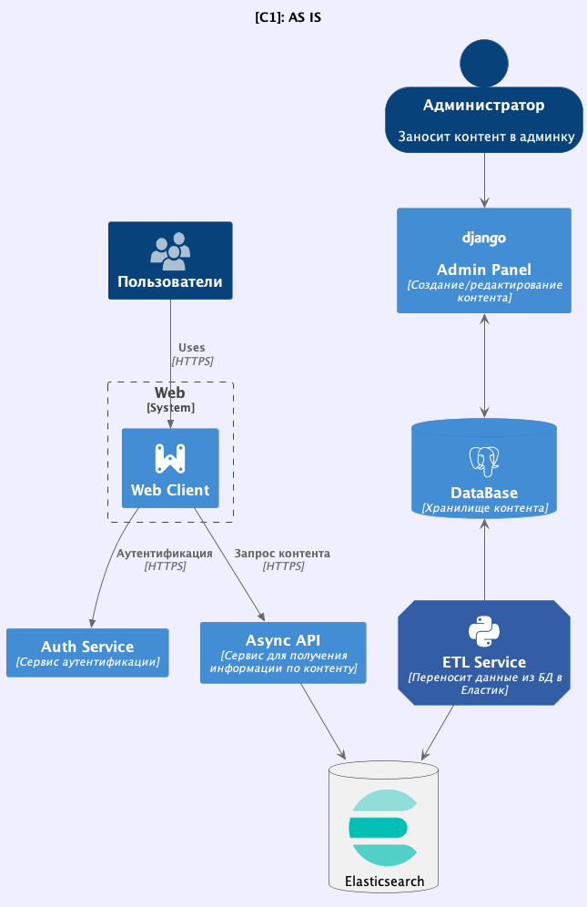
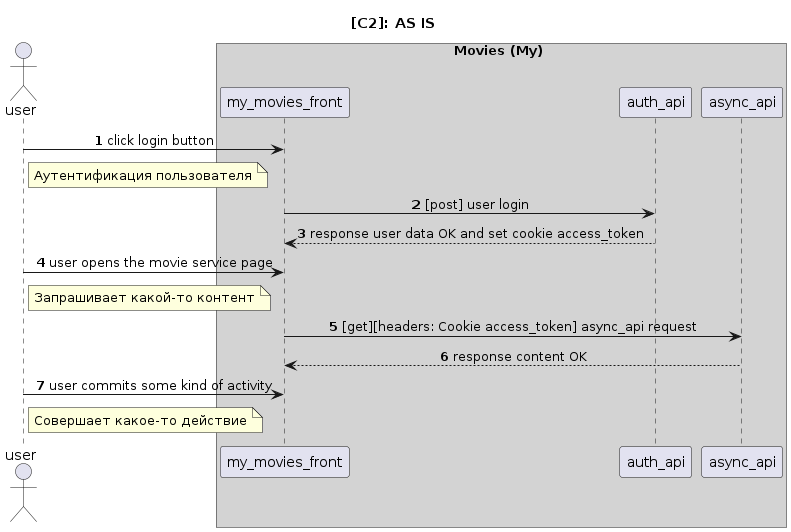
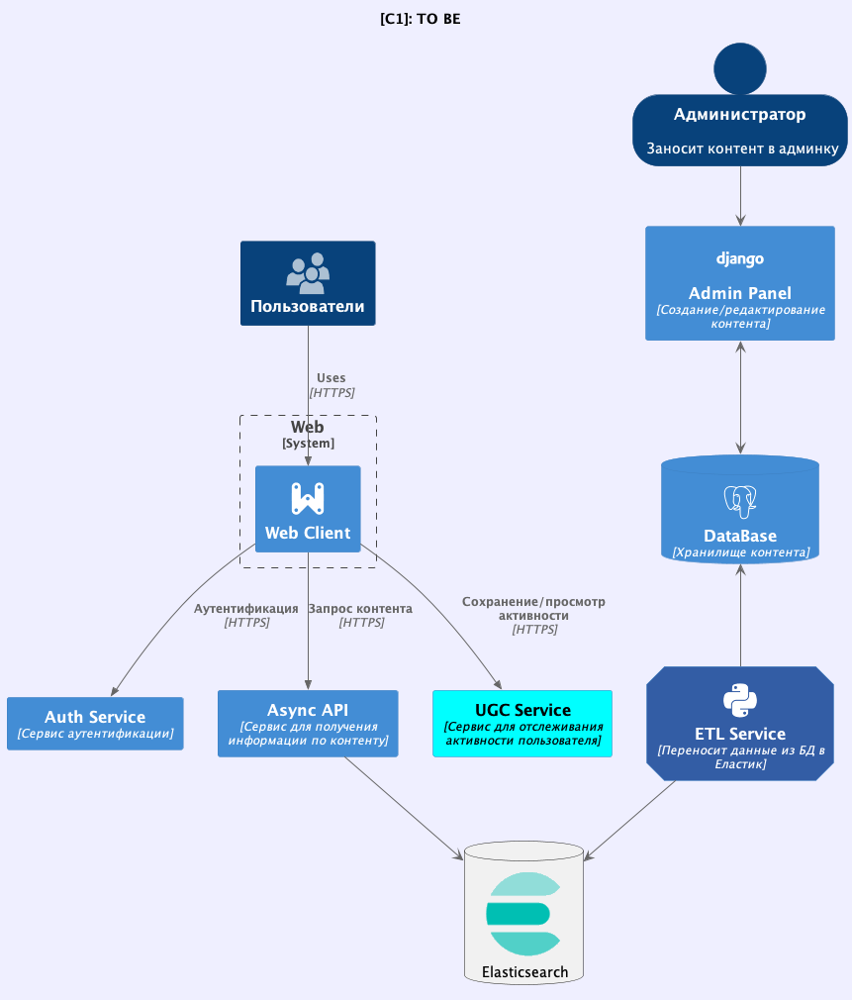
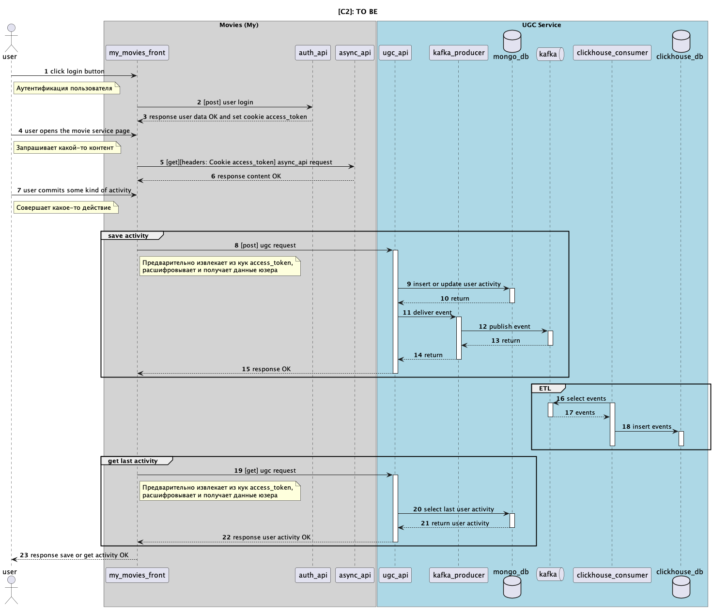
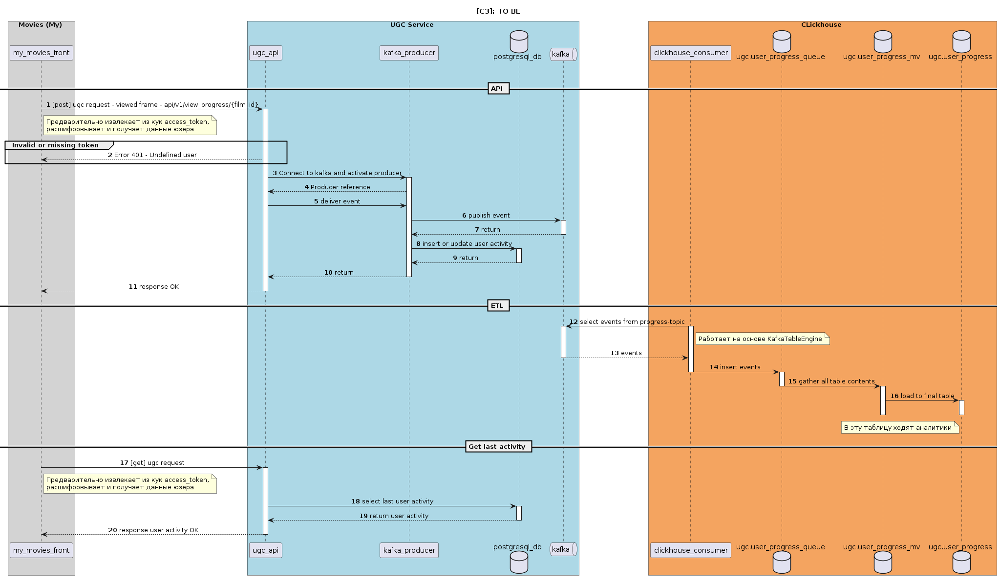

# Movies UGC service

## Contributors

- Vladimir Nikishov - T1rax - @nikishov.va
- Victoria Axentii - wiky-avis - @wikyavis
- Oleg Podryadov - opodryadov - @oleg_podryadov

## Major components

- Event storage - kafka
- Event API - loads events to event storage
- NoSQL Database - MongoDB
- OLAP Database - Clickhouse
- ETL - loads events from event storage to database for analytical purposes (Kafka Table Engine)
- ELK (Elasticsearch Logstash Kibana) - used for centralized collection, processing, and visualization of logs and metrics in real-time to enable proactive monitoring and analysis of a project.
- Sentry - used for monitoring and tracking errors in an application, allowing for quick detection, analysis, and resolution of issues to improve the reliability and stability of the project.
- Jaeger - used for performance testing and load testing web applications, allowing to assess and analyze their ability to handle various loads and conditions, to ensure optimal project performance.

## How to start app

Project uses makefiles to boot apps. There are mulltiple boot configurations: production and development.
The difference is that dev has open ports and separate volumes. Tests boot on dev environment.

### Steps to follow

#### Boot everything in production mode

1. `make up-prod`

#### Boot everything in development mode (open ports and separate volumes)

1. `cp .env_local .env`
2. `make up-local`

#### E2E tests

1. Uncomment in e2e tests in docker-compose-local.yml
2. `make up-local`

#### Unit tests

1. Up python virtual env - venv
2. Install dependencies - `poetry install`
3. Create .env file `cp .env_test .env`
4. Run `pytest tests/src/unit`

#### ELK
1. `make up-elk`

#### Sentry
1. Turn on **ENABLE_SENTRY** in your .env-file
2. Set your dsn from sentry.io to **SENTRY_DSN** in your .env-file

#### Jaeger
1. Turn on **ENABLE_TRACER** in your .env-file

## Useful commands

### Production

- Up+build `make up-prod`
- Up+build+detach `make up-prod-d`
- Down `make down-prod`

### Development/test

- Up+build `make up-local`
- Up+build+detach `make up-local-d`
- Down + remove volumes `make down-local`

### ELK
- Up+build+detach `make up-elk`
- Down `make down-elk`

### MongoDB Cluster
- Start all of the containers
```bash
docker-compose -f docker-compose-mongo-cluster.yml up -d
```
- Initialize the replica sets (config servers and shards)
```bash
docker-compose -f docker-compose-mongo-cluster.yml exec configsvr01 sh -c "mongosh < /scripts/init-configserver.js"

docker-compose -f docker-compose-mongo-cluster.yml exec shard01-a sh -c "mongosh < /scripts/init-shard01.js"
docker-compose -f docker-compose-mongo-cluster.yml exec shard02-a sh -c "mongosh < /scripts/init-shard02.js"
docker-compose -f docker-compose-mongo-cluster.yml exec shard03-a sh -c "mongosh < /scripts/init-shard03.js"

// Initializing the router
docker-compose -f docker-compose-mongo-cluster.yml exec router01 sh -c "mongosh < /scripts/init-router.js"

// Enable sharding and setup sharding-key
docker-compose -f docker-compose-mongo-cluster.yml exec router01 sh -c "mongosh < /scripts/enable-sharding.js"
```

- Enable new sharding and setup new sharding-key
```bash
docker-compose -f docker-compose-mongo-cluster.yml exec router01 mongosh --port 27017

// Enable sharding for database `MyDatabase`
sh.enableSharding("MyDatabase")

// Setup shardingKey for collection `MyCollection`
db.adminCommand( { shardCollection: "MyDatabase.MyCollection", key: { oemNumber: "hashed", zipCode: 1, supplierId: 1 } } )
```
- Check database status
```bash
docker-compose -f docker-compose-mongo-cluster.yml exec router01 mongosh --port 27017
use MyDatabase
db.stats()
db.MyCollection.getShardDistribution()
```
- Verify the status of the sharded cluster 
```bash
docker-compose -f docker-compose-mongo-cluster.yml exec router01 mongosh --port 27017
sh.status()
```
- Verify status of replica set for each shard
```bash
docker -f docker-compose-mongo-cluster.yml exec -it shard-01-node-a bash -c "echo 'rs.status()' | mongosh --port 27017"
docker -f docker-compose-mongo-cluster.yml exec -it shard-02-node-a bash -c "echo 'rs.status()' | mongosh --port 27017"
docker -f docker-compose-mongo-cluster.yml exec -it shard-03-node-a bash -c "echo 'rs.status()' | mongosh --port 27017"
```
- Resetting the Cluster
```bash
docker-compose -f docker-compose-mongo-cluster.yml rm
```
- Clean up docker-compose
```bash
docker-compose -f docker-compose-mongo-cluster.yml down -v --rmi all --remove-orphans
```

## API information

**Swagger** - http://localhost/swagger

### Schemas

PlantUML schemas could be found in folder docs.
They are written in C$ notation up to C3 level.
More about C4 notation - https://c4model.com

#### Contents

- As-Is - Infrastructure before this project
- To-Be - Information about this project

## Schemas images

### AS IS

#### C1 as is



#### C2 as is



### TO BE

#### C1 to be



#### C2 to be



#### C3 to be


